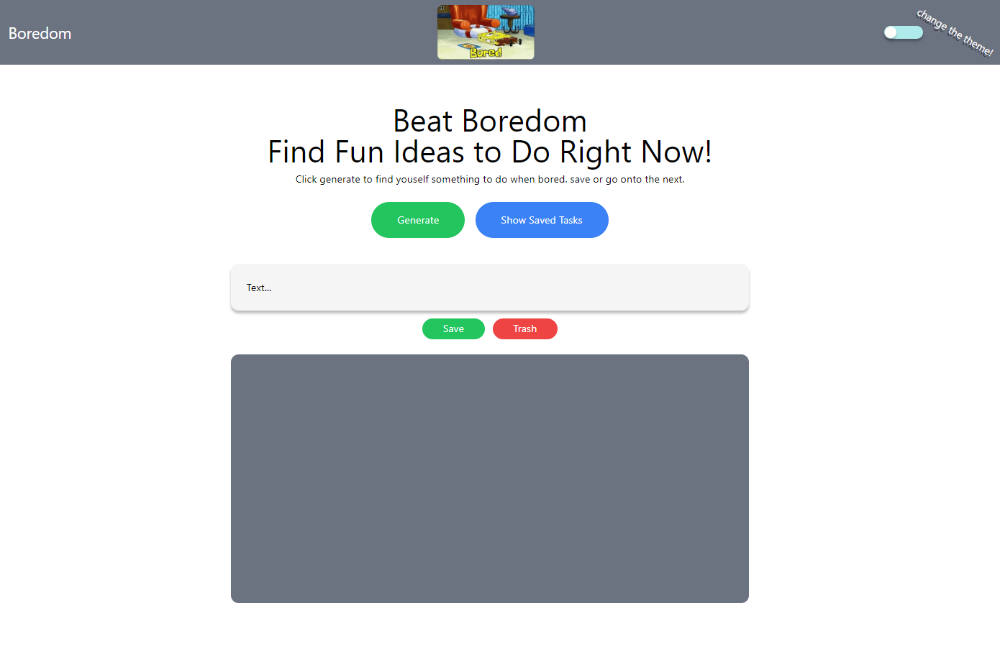

# Boredom

## Description

Our website is a tool used to demloish boredom! We've all had days where we have free time but cant think of anything fun or exciting to do with that time, well say goodbye to those times! This website will solve that problem with the simple clcik of a button, once the button is clicked you get a random activity and a image correlating to that activity, if the activity is spmething you like but may not want to commit to right away, then you can just save it for later! If the activty just doesn't tickle your fancy, then you can just trash it and generate a new one with another simple click of a button! Throughout this activity as a group we learned how to build a site through communicating through one another and helping eachother when stumped on the next step we needed to take, we also gained a better understanding of using API's getting 2 different API's to work properly with each other.

## Usage
GIVEN a boredom app
WHEN I click the generate button
THEN I am presented with an activity task
WHEN I click the save button 
THEN the task is moved to the saved tasks 
WHEN I click the trash button
THEN the task is removed

## Credits

Collaborators: 
Owen Kanzler, Scott Strokel, Eli Ward, Jesse Theis, & Dameine Yang

Github Links:
https://github.com/owenkanzler,
https://github.com/storkel,
https://github.com/ElijahWard4,
https://github.com/JesseTheis,
https://github.com/Dameine

## License

Mit License

## Deployed Links

## Screenshots 

